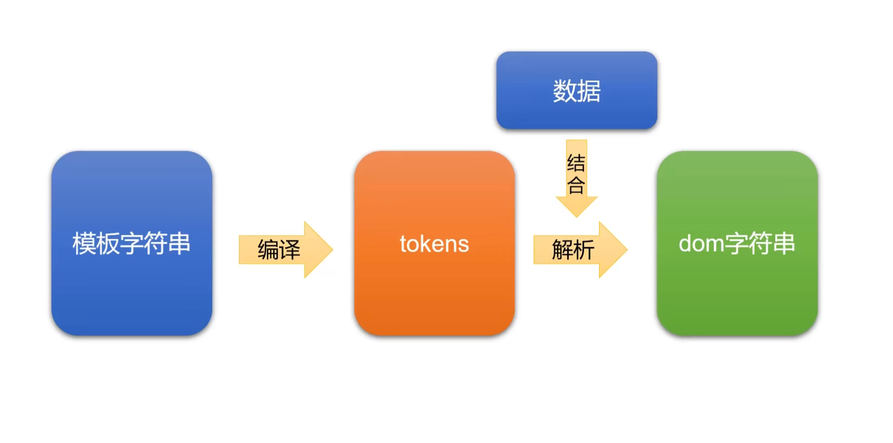

## Vue 模板引擎是什么？

模板引擎指 Vue Template 中渲染数据的模板解析引擎，例如常见的 `v-for`、`v-if`、`v-show` 等等，模板引擎是将数据变为视图最优雅的解决方案。

<!-- more -->

历史中曾经出现的数据转换为视图的方法：

- 纯 DOM 法：非常笨拙，没有实战价值
- 数据 JSON 法：曾几何时非常流行，是曾经的前端必会知识
- ES6 的反引号法：ES6 中新增的`${a}`语法糖
- 模板引擎：解决数据变为视图的最优雅的方法

## mustache 模板引擎又是什么？

mustache 是“胡子”的意思，因为它的嵌入标记 `{{ }}` 非常像胡子。

`{{ }}` 的语法也被 vue 沿用。

注意，mustache 的 `{{ }}` 内是不能像 vue 里那样写表达式。

使用 mustache 需要引入 mustache 库，可以直接通过 cdn 方式引入。

然后通过 `Mustache.render(templateStr, data)` 方式生成 dom 模板。

### 渲染对象数组

~~~html

~~~

~~~html

~~~

~~~js
const data = {
  arr: [
    { name: 'Jay', age: 18 },
    { name: 'Bin', age: 20 }
  ]
}
// dom 模板
const templateString = `
  <ul>
    {{#arr}}
      <li>
        
{{name}}的基本信息

        

          
{{name}}

          
{{age}}

        

      </li>
    {{/arr}}
  </ul>
`
const domString = Mustache.render(templateString, data)
const box = document.querySelector('#box')
box.innerHTML = domString
~~~

### 渲染简单数组

在模板里就用 `.` 表示数组的每一项

~~~js
// 数据
const data = {
  arr: ['红', '橙', '黄']
}
// dom 模板
const templateStr = `
    <ul>
      {{#arr}}
        <li>
          {{.}}
        </li>
      {{/arr}}
  </ul>
`
~~~

### 布尔值

也有像 vue 里 `v-if` 那样的用法 ，当 `m` 值为 `true`，里面的 `div` 就会被挂载到 `dom` 树上，否则不会

~~~js
// 数据
const data = {
  m: true
}
// dom 模板
const templateStr = `
    

      {{#m}}
        
aaa

      {{/m}}
  

`
~~~

## mustache 的底层核心机理

mustache 不能用简单的正则表达式思路实现，当情况复杂时，难以通过正则实现。

mustache tokens 思想 

## 什么是 tokens？

更改 mustache 源码 256 行，输出 tokens

## mustache 源码实现

具体实现在：`高级框架/VueCore/mustache/03-mustache模板实现`，使用 vite 直接运行

~~~ts
import parseTemplateToTokens from './parseTemplateToTokens'
import renderTemplate from './renderTemplate'

const Mustache = {
  render(template: string, data: Record<string, any>) {
    // 解析为抽象树
    const tokens = parseTemplateToTokens(template)
    // 将数据与树结合为结果
    const result = renderTemplate(tokens, data)
    console.log('tokens:', tokens)
    console.log('result:', result)
    return result
  }
}

export default Mustache
~~~

~~~html

~~~